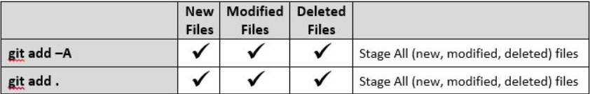

# 大学生工作前技能提升
 

## 每日学习心得

阅读springboot官网文档，复习，考试，学习markdownpad2书写工具。 7/10/2018 5:48:57 PM 

考试：编译原理是真的难。7/11/2018 10:23:49 AM 

考试：计算机体系结构，明天还有一门考试。考完试正式去实习培训。南京，等我！

所以git中，加“.”和加A 是一样的

7/11/2018 7:18:47 PM 

考试完毕：接下来就剩下下学期大四唯一的一次考试！ 7/12/2018 9:46:56 AM 

我的学校game

git reset head <file>暂存区回退到工作区
git remote set-url origin https://...../.git

******
学习spring boot 官方文档 7/14/2018 10:04:16 AM 

#假期任务

java基础

学习java开源框架

学习计算机网络基础

做一个自己的项目或者对之前的项目进行更新

今天完成：阅读spring boot官方文档/。

7/15/2018 5:04:48 PM 
今日计划，学习java基础

抵达南京，进行学习！
7/17/2018 10:47:24 PM 

参观总部，听取培训内容
7/18/2018 9:07:29 AM 

继续开会，培训
7/19/2018 9:11:29 AM 

昨天学习了角色授权和数据库存储过程，今天继续学习。
7/20/2018 8:45:31 AM 

听同事讲到了做笔记以及文档归档的重要性，是评判工作绩效的有利证据，也是对以后学习总结有重要意义的事情。7/21/2018 9:57:16 PM 

考勤系统代码逻辑思考
7/22/2018 8:36:28 PM 

体验了城市上班生活，怎么说，学到的东西很多，见识到的东西很多。
7/24/2018 8:45:06 AM 

最后一天培训7/25/2018 8:58:54 AM 

> 面向对象是一种对现实世界理解和抽象的方法，是计算机编程技术  发展到一定阶段后的产物。

idear:github便利贴 
昨天回到学校，开始搞指纹考勤web业务逻辑功能
7/27/2018 11:10:05 AM 
# 安排 #
1. odi学会
2. web考勤打卡
3. 微信小程序答题系统
4. 英语

学习odi和制作微信小程序题库
7/28/2018 9:41:52 AM 

java基础复习
7/29/2018 2:11:20 PM 

公司odi操作，java基础熟悉
7/30/2018 1:32:44 PM 

阅读spring boot官方文档，阅读thymeleaf官方文档。
7/31/2018 1:31:58 PM 

答题微信小程序，指纹考勤系统，编译原理
8/1/2018 1:32:44 PM 

学习常用的数据结构和算法。
8/2/2018 9:09:07 AM 

学习常用的数据结构和算法，帮同学做微信小程序答题系统。
8/3/2018 11:08:30 PM 

阅读spring boot官方文档
8/11/2018 2:36:43 PM 

阅读spring boot官方文档到39. Quartz Scheduler，阅读spring core technologies
8/13/2018 3:11:53 PM 

指纹考勤系统前端页面，服务器搭建
8/14/2018 8:11:03 PM 

指纹考勤系统bug修改
8/15/2018 5:10:06 PM 

指纹考勤系统，阅读spring文档，my batis多条件查询
8/16/2018 8:43:22 PM 

科目二俩天。
8/23/2018 6:12:27 PM

阅读spring mvc文档
9/1/2018 4:28:03 PM  

学习的算法。阅读spring文档
9/2/2018 6:10:32 PM 

阅读spring文档，背单词。
9/6/2018 9:05:24 PM 

学习spring ,背单词。
9/7/2018 5:57:02 PM 

学习spring ,背单词
9/8/2018 11:54:49 AM 

学习spring ,背单词
9/9/2018 3:09:45 PM 

智能考勤系统文档书写，背单词，学习编译原理。
9/11/2018 1:01:43 PM 

cet  spring 
9/15/2018 7:33:59 PM  

cet  spring grammar
9/16/2018 5:23:59 PM 

背单词，写论文，学习java相关内容。
9/17/2018 3:05:54 PM 

背单词，实习工作。阅读spring mvc
9/18/2018 7:20:46 PM 

学习linux,阅读spring文档。
9/19/2018 6:38:15 PM 

背单词，阅读spring文档。
9/20/2018 2:07:40 PM 

论文开题，背单词
9/21/2018 7:55:32 PM 

撰写开题报告、背单词
9/22/2018 7:08:20 PM 

帮同学看论文
9/23/2018 4:58:06 PM 

帮同学看论文，过中秋，在湖南。
9/24/2018 8:25:24 PM 

果蔬项目，学习spring mvc。
9/25/2018 3:06:32 PM 

果蔬项目，背单词
9/26/2018 1:41:00 PM 

背单词，上课，学习Oracle
9/27/2018 2:29:17 PM 

果蔬项目合同，上课，开始准备java面试。
9/28/2018 10:11:57 AM 

学习java知识，上课，工作
9/29/2018 9:33:44 PM 

学习算法、背单词
10/1/2018 8:13:13 PM 

背单词，准备java面试
10/2/2018 10:49:44 PM 

背单词，准备java面试
10/3/2018 6:05:54 PM 

背单词
10/4/2018 10:30:12 PM 

背单词,微信小程序
10/5/2018 8:16:36 PM 

校庆信息采集网站，论文修改
10/7/2018 6:47:28 PM 

校友信息系统
10/8/2018 6:22:36 PM 

最近几天忙校友信息录入系统，没有push
10/11/2018 9:31:32 AM 

背单词，学习java基础知识
10/12/2018 6:45:26 PM 

